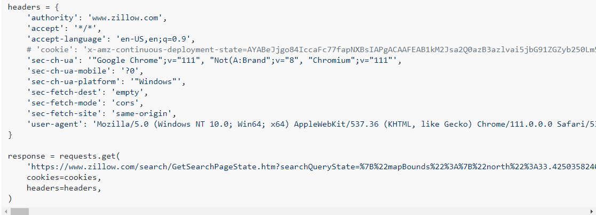

## **Extracting dataset from Zillow**

The first step in any machine learning project is to obtain a dataset. In this case, we will use Zillow's GetSearchPageState request in order to retrieve the search results of a particular query. 

The initial page shown when looking for real estate listings on Zillow, shows all of the listings on a map, or a menu with multiple pages. In this case, we are looking for all of the homes sold in San Diego County in the last 12 months (April 2022 - April 2023).


We can extract the listings that match our query by using the request that Zillow itself uses to retrieve the data, called GetSearchPageState. We can acess this request by opening the browser's developer tools, and looking at the Fetch/XHR network requests. We find that a GetSearchPageState request is made every time we change the parameters of the query (map size, price range, pagination, etc.)


We can look at a preview of the request response, which returns a nested dictionary of all of the data retrieved by the request. This response contains information about the number of listings, the number of pages, and most importantly, the actual data of the listings. 


As we can see, the listings are held in a list inside the request response. We will use Python to make the requests that extract all (or most) of our data in order to build a dataset directly from Zillow's listings.

We start off by copying the request as a Bash(cURL) request and use an online tool that will convert our request to the Python language. We get a dictionary of request headers, which are constant for every request made using Zillow, and a request link, whose response will be obtained using the .get method from the Python requests module. 



We can move on to implementing the Python code. First, we import the modules that are going to be needed. We will use requests to make the requests and retrieve the responses, and pandas to save the data from the listings to a dataframe.


```python
# Import required modules
import numpy as np
import pandas as pd
import requests
pd.set_option('display.max_rows', None)
pd.set_option('mode.chained_assignment',None)
```

Since the request headers are all constant between links from a common website, we can use them for all of the requests we are going to make. 


```python
# Define the request headers (taken from Zillow GetSearchPageState API request)
headers = {
    'authority': 'www.zillow.com',
    'accept': '*/*',
    'accept-language': 'es-ES,es;q=0.9,en-US;q=0.8,en;q=0.7',
    'sec-ch-ua': '"Chromium";v="112", "Google Chrome";v="112", "Not:A-Brand";v="99"',
    'sec-ch-ua-mobile': '?0',
    'sec-ch-ua-platform': '"Windows"',
    'sec-fetch-dest': 'empty',
    'sec-fetch-mode': 'cors',
    'sec-fetch-site': 'same-origin',
    'user-agent': 'Mozilla/5.0 (Windows NT 10.0; Win64; x64) AppleWebKit/537.36 (KHTML, like Gecko) Chrome/112.0.0.0 Safari/537.36',
}
```

The GetSearchPageState API request can give a maximum of 500 results from the map, and 40 results for every page, but it was found that a lot of listings were lost when using the map results, so we will define a search query, extract the results from one page, then move over to the next page and so on, until we get all the results associated with the query. 
The get_data function accepts a request URL associated with certain parameters, extracts the number of pages and iterates through every page in order to retrieve all of the listings. 


```python
# Function that takes in a request URL and returns a list of dictionaries with the data for the Zillow listings from each result page
def get_data(url):
    response = requests.get(url, headers=headers)
    pages = response.json()['cat1']['searchList']['totalPages']
    data = []
    split = url.split('%22currentPage%22%3A2')
    for page in range(1, pages+1):
        page_url = split[0] + '%22currentPage%22%3A' + str(page) + split[1]
        response = requests.get(page_url, headers=headers)
        data.extend(response.json()['cat1']['searchResults']['listResults'])
    return data
```

Just as the map results, the list results on Zillow are also limited to a maximum of 40 results per page, at 20 pages max for a maximum of 800 listings per query. We will use price ranges in order to reduce the number of listings associated with each query so that we can extract as much data as possible. Below, we make a list of all request links of listings with prices ranging from \\$0 to \\$20,000,000, and we run each link through our page iterating function in order to obtain a list with the information of every house found in Zillow that was sold in the last 12 months in San Diego County.


```python
# Defining the bins for the price range
bins = [i * 20000 for i in range(0, 1001)]

# Generating the request URLs for each price range (to mitigate the 500 maximum results per page limit)
links = ['https://www.zillow.com/search/GetSearchPageState.htm?searchQueryState=%7B%22mapBounds%22%3A%7B%22north%22%3A33.97337635760156%2C%22east%22%3A-115.66360693554688%2C%22south%22%3A32.052726223972044%2C%22west%22%3A-118.02841406445313%7D%2C%22isMapVisible%22%3Atrue%2C%22filterState%22%3A%7B%22doz%22%3A%7B%22value%22%3A%2212m%22%7D%2C%22sortSelection%22%3A%7B%22value%22%3A%22globalrelevanceex%22%7D%2C%22isAllHomes%22%3A%7B%22value%22%3Atrue%7D%2C%22isRecentlySold%22%3A%7B%22value%22%3Atrue%7D%2C%22isForSaleByAgent%22%3A%7B%22value%22%3Afalse%7D%2C%22isForSaleByOwner%22%3A%7B%22value%22%3Afalse%7D%2C%22isNewConstruction%22%3A%7B%22value%22%3Afalse%7D%2C%22isComingSoon%22%3A%7B%22value%22%3Afalse%7D%2C%22isAuction%22%3A%7B%22value%22%3Afalse%7D%2C%22isForSaleForeclosure%22%3A%7B%22value%22%3Afalse%7D%2C%22price%22%3A%7B%22min%22%3A' + str(bins[i+1]) + '%2C%22min%22%3A' + str(bins[i]) +'%7D%2C%22monthlyPayment%22%3A%7B%22min%22%3A494%2C%22max%22%3A987%7D%7D%2C%22isListVisible%22%3Atrue%2C%22regionSelection%22%3A%5B%7B%22regionId%22%3A2841%2C%22regionType%22%3A4%7D%5D%2C%22pagination%22%3A%7B%22currentPage%22%3A2%7D%2C%22mapZoom%22%3A9%7D&wants={%22cat1%22:[%22listResults%22,%22mapResults%22]}&requestId=12' for i in range(len(bins)-1)]

# Extracting the data of all listings
import tqdm
listings = []
for link in tqdm.tqdm(links):
    listings.extend(get_data(link))
```

Now, we iterate though every listing, extract the useful information and append it to a dataframe as a new entry. 


```python
# Extract the important information from the listings and converting to pandas dataframe
df = pd.DataFrame()
for listing in tqdm.tqdm(listings):
    if 'hdpData' in listing:
        information = listing['hdpData']['homeInfo']
        df = pd.concat([df, pd.DataFrame(information, index=[0])], axis=0)
```

Finally, we clean our data by removing duplicate listings, resetting the index and saving it as a .csv file so that it can be loaded without making the requests a second time.


```python
# Clean the data and save to .csv
df = df.drop_duplicates(subset=['zpid'])
df.reset_index(drop = True, inplace=True)
df.to_csv('zillow_listings.csv', index=False)
```

Now that we saved the dataframe, we can visualize the first 5 entries of our dataset, which consists of 26701 listings with 44 features each.


```python
# Visualize the data
pd.set_option('display.max_columns', None)
df.head(5)
```


<div>
<table border="1" class="dataframe">
  <thead>
    <tr style="text-align: right;">
      <th></th>
      <th>zpid</th>
      <th>streetAddress</th>
      <th>zipcode</th>
      <th>city</th>
      <th>state</th>
      <th>latitude</th>
      <th>longitude</th>
      <th>price</th>
      <th>dateSold</th>
      <th>bathrooms</th>
      <th>bedrooms</th>
      <th>livingArea</th>
      <th>homeType</th>
      <th>homeStatus</th>
      <th>daysOnZillow</th>
      <th>isFeatured</th>
      <th>shouldHighlight</th>
      <th>zestimate</th>
      <th>rentZestimate</th>
      <th>listing_sub_type</th>
      <th>isUnmappable</th>
      <th>isPreforeclosureAuction</th>
      <th>homeStatusForHDP</th>
      <th>priceForHDP</th>
      <th>isNonOwnerOccupied</th>
      <th>isPremierBuilder</th>
      <th>isZillowOwned</th>
      <th>currency</th>
      <th>country</th>
      <th>taxAssessedValue</th>
      <th>lotAreaValue</th>
      <th>lotAreaUnit</th>
      <th>unit</th>
      <th>isRentalWithBasePrice</th>
      <th>datePriceChanged</th>
      <th>priceReduction</th>
      <th>priceChange</th>
      <th>videoCount</th>
      <th>providerListingID</th>
      <th>newConstructionType</th>
      <th>contingentListingType</th>
      <th>openHouse</th>
      <th>open_house_info</th>
      <th>comingSoonOnMarketDate</th>
    </tr>
  </thead>
  <tbody>
    <tr>
      <th>0</th>
      <td>16765112</td>
      <td>2330 Via Aprilia</td>
      <td>92014</td>
      <td>Del Mar</td>
      <td>CA</td>
      <td>32.934574</td>
      <td>-117.251900</td>
      <td>8500.0</td>
      <td>1.680246e+12</td>
      <td>4.0</td>
      <td>3.0</td>
      <td>2899.0</td>
      <td>SINGLE_FAMILY</td>
      <td>RECENTLY_SOLD</td>
      <td>-1</td>
      <td>False</td>
      <td>False</td>
      <td>2759800.0</td>
      <td>9650.0</td>
      <td>NaN</td>
      <td>False</td>
      <td>False</td>
      <td>RECENTLY_SOLD</td>
      <td>8500.0</td>
      <td>True</td>
      <td>False</td>
      <td>False</td>
      <td>USD</td>
      <td>USA</td>
      <td>1340151.0</td>
      <td>7840.00</td>
      <td>sqft</td>
      <td>NaN</td>
      <td>NaN</td>
      <td>NaN</td>
      <td>NaN</td>
      <td>NaN</td>
      <td>NaN</td>
      <td>NaN</td>
      <td>NaN</td>
      <td>NaN</td>
      <td>NaN</td>
      <td>NaN</td>
      <td>NaN</td>
    </tr>
    <tr>
      <th>1</th>
      <td>16731749</td>
      <td>16938 Via De Santa Fe</td>
      <td>92091</td>
      <td>Rancho Santa Fe</td>
      <td>CA</td>
      <td>33.018356</td>
      <td>-117.201935</td>
      <td>6499.0</td>
      <td>1.677917e+12</td>
      <td>2.0</td>
      <td>2.0</td>
      <td>1530.0</td>
      <td>CONDO</td>
      <td>RECENTLY_SOLD</td>
      <td>-1</td>
      <td>False</td>
      <td>False</td>
      <td>1359200.0</td>
      <td>3898.0</td>
      <td>NaN</td>
      <td>False</td>
      <td>False</td>
      <td>RECENTLY_SOLD</td>
      <td>6499.0</td>
      <td>True</td>
      <td>False</td>
      <td>False</td>
      <td>USD</td>
      <td>USA</td>
      <td>557001.0</td>
      <td>NaN</td>
      <td>NaN</td>
      <td>NaN</td>
      <td>NaN</td>
      <td>NaN</td>
      <td>NaN</td>
      <td>NaN</td>
      <td>NaN</td>
      <td>NaN</td>
      <td>NaN</td>
      <td>NaN</td>
      <td>NaN</td>
      <td>NaN</td>
      <td>NaN</td>
    </tr>
    <tr>
      <th>2</th>
      <td>82941077</td>
      <td>260 E Bradley Ave SPACE 29</td>
      <td>92021</td>
      <td>El cajon</td>
      <td>CA</td>
      <td>32.821266</td>
      <td>-116.958670</td>
      <td>20000.0</td>
      <td>1.677139e+12</td>
      <td>1.0</td>
      <td>2.0</td>
      <td>800.0</td>
      <td>MANUFACTURED</td>
      <td>RECENTLY_SOLD</td>
      <td>-1</td>
      <td>False</td>
      <td>False</td>
      <td>NaN</td>
      <td>2281.0</td>
      <td>NaN</td>
      <td>False</td>
      <td>False</td>
      <td>RECENTLY_SOLD</td>
      <td>20000.0</td>
      <td>True</td>
      <td>False</td>
      <td>False</td>
      <td>USD</td>
      <td>USA</td>
      <td>24248.0</td>
      <td>2.78</td>
      <td>acres</td>
      <td>Space 29</td>
      <td>NaN</td>
      <td>NaN</td>
      <td>NaN</td>
      <td>NaN</td>
      <td>NaN</td>
      <td>NaN</td>
      <td>NaN</td>
      <td>NaN</td>
      <td>NaN</td>
      <td>NaN</td>
      <td>NaN</td>
    </tr>
    <tr>
      <th>3</th>
      <td>61238050</td>
      <td>220 Lyon Cir</td>
      <td>92083</td>
      <td>Vista</td>
      <td>CA</td>
      <td>33.192005</td>
      <td>-117.238144</td>
      <td>3895.0</td>
      <td>1.676880e+12</td>
      <td>2.5</td>
      <td>3.0</td>
      <td>1903.0</td>
      <td>SINGLE_FAMILY</td>
      <td>RECENTLY_SOLD</td>
      <td>-1</td>
      <td>False</td>
      <td>False</td>
      <td>828800.0</td>
      <td>3792.0</td>
      <td>NaN</td>
      <td>False</td>
      <td>False</td>
      <td>RECENTLY_SOLD</td>
      <td>3895.0</td>
      <td>True</td>
      <td>False</td>
      <td>False</td>
      <td>USD</td>
      <td>USA</td>
      <td>569249.0</td>
      <td>9741.00</td>
      <td>sqft</td>
      <td>NaN</td>
      <td>NaN</td>
      <td>NaN</td>
      <td>NaN</td>
      <td>NaN</td>
      <td>NaN</td>
      <td>NaN</td>
      <td>NaN</td>
      <td>NaN</td>
      <td>NaN</td>
      <td>NaN</td>
      <td>NaN</td>
    </tr>
    <tr>
      <th>4</th>
      <td>16875584</td>
      <td>9356 Las Lomas Dr</td>
      <td>92071</td>
      <td>Santee</td>
      <td>CA</td>
      <td>32.863760</td>
      <td>-117.001550</td>
      <td>1000.0</td>
      <td>1.675843e+12</td>
      <td>2.0</td>
      <td>3.0</td>
      <td>1676.0</td>
      <td>SINGLE_FAMILY</td>
      <td>RECENTLY_SOLD</td>
      <td>-1</td>
      <td>False</td>
      <td>False</td>
      <td>893100.0</td>
      <td>3800.0</td>
      <td>NaN</td>
      <td>False</td>
      <td>False</td>
      <td>RECENTLY_SOLD</td>
      <td>1000.0</td>
      <td>True</td>
      <td>False</td>
      <td>False</td>
      <td>USD</td>
      <td>USA</td>
      <td>795000.0</td>
      <td>NaN</td>
      <td>NaN</td>
      <td>NaN</td>
      <td>NaN</td>
      <td>NaN</td>
      <td>NaN</td>
      <td>NaN</td>
      <td>NaN</td>
      <td>NaN</td>
      <td>NaN</td>
      <td>NaN</td>
      <td>NaN</td>
      <td>NaN</td>
      <td>NaN</td>
    </tr>
  </tbody>
</table>
</div>


In the next steps of the project, we will use this dataset to visualize the patterns in the data, and build a model that predicts the price based on common variables in the data.
