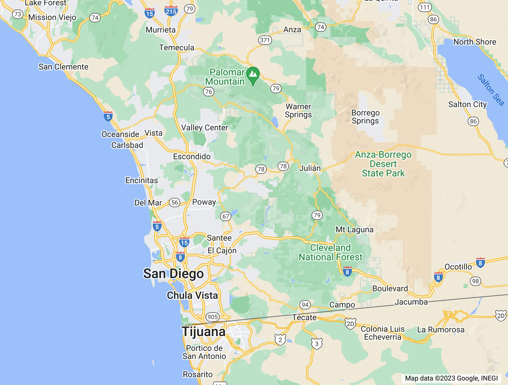
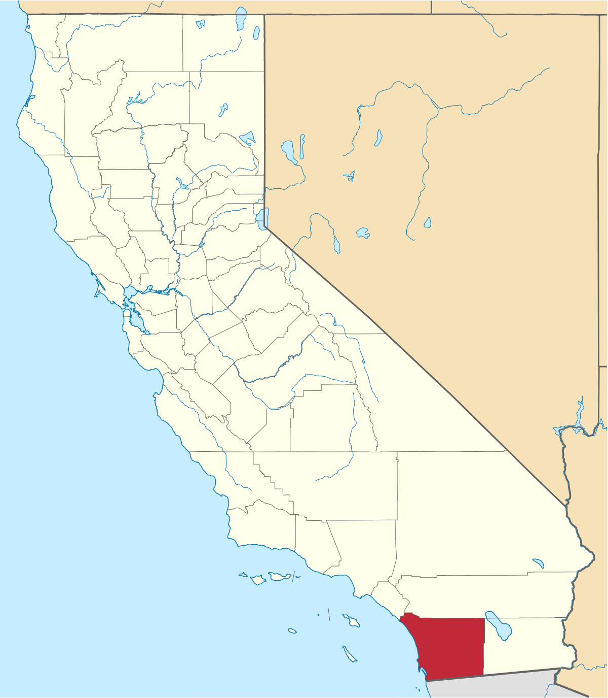
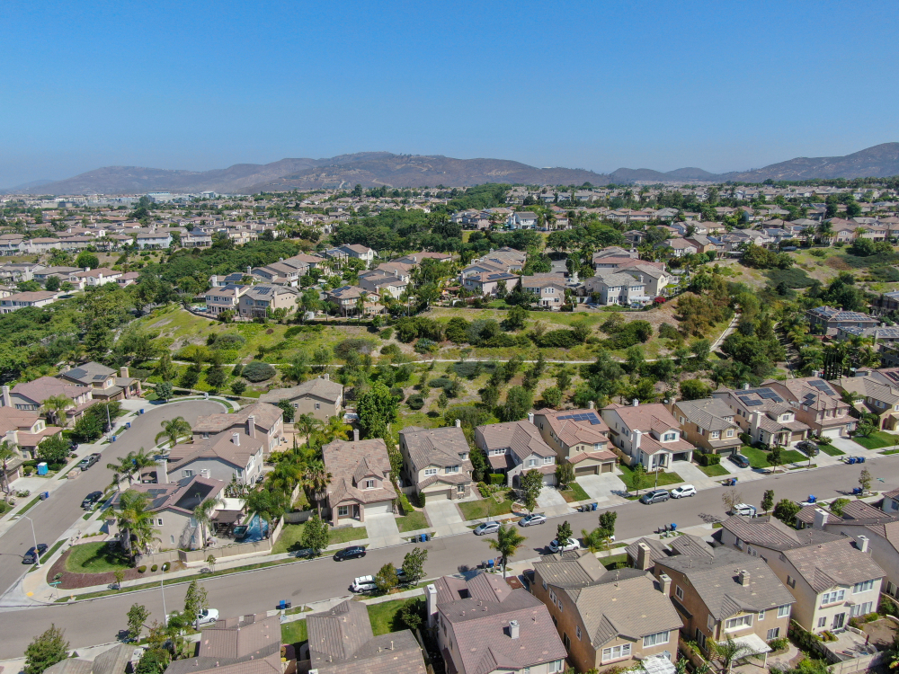
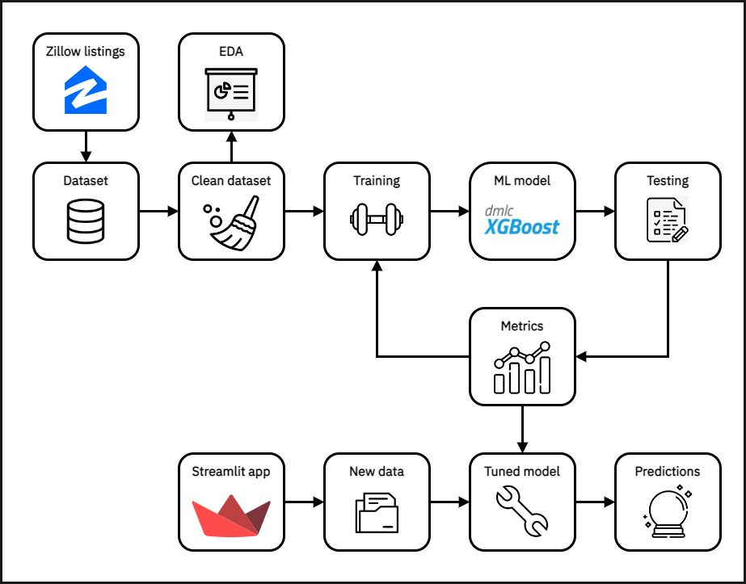

# **House Price Predictions in San Diego County** :house_with_garden: :moneybag:

## **Introduction**
**San Diego County** is located in southwest California. It is one of the most populous counties in the United States, with over 3.3 million inhabitants, comprising 18 different cities, including the San Diego - Chula Vista - Carlsbad Metropolitan Area, which is the 17th most populous metropolitan area in the United States. San Diego County also has a direct border with Mexico, and the San Ysidro Port of Entry is the busiest land border crossing in the entire western hemisphere.

|                           |                              |
|:----------------------------------------------------------------------:|:---------------------------------------------------------------------------------:|
| ***Figure 1.**  San Diego County in Google Maps*                        | ***Figure 2.** Location of San Diego County*                        |

San Diego County has one of the most expensive real estate markets in the country, caused by a rising millenial population looking for homes, and a stable, diverse economy fueled by industries like tourism, healthcare, technology, defense, government dependencies, international trade and scientific reseach, creating a big job market that increases demand for housing. Like most US counties, the San Diego County urban layout follows a trend of big commercial and industrial areas, surrounded by beautiful, calm **suburbs** that are mainly residential.

 

|                        |                       |
|:----------------------------------------------------------------------:|:---------------------------------------------------------------------------------:|
| ***Figure 3.**  Black Mountain area in San Diego County*                        | ***Figure 4.** Typical suburban home in San Diego County*          |

 

The geographical location of San Diego County is a big factor in the power of the real estate market, since it is located next to the Pacific Ocean and has a really **comfortable weather** and **nice views** all year long, with a big percent of its residents being senior citizens that look for a beautiful and calm city to live in.

 

|                       |                   |
|:----------------------------------------------------------------------:|:---------------------------------------------------------------------------------:|
| ***Figure 5.**  Downtown San Diego area*                        | ***Figure 6.** La Jolla area*          |

 

## **Project overview**
In this project, we will webscrape the **Zillow** website to extract a dataset of real estate listings in the San Diego County, explore the **statistics** and **patterns** behind the scraped dataset, and build a robust **machine learning** pipeline that cleans and prepares our data, and estimates a **sale price** based on key predictor variables like living area, neighborhood, number of bedrooms, among others, with the objective of making a simple **web application** that inputs the information of a house in San Diego County and returns an estimated selling price.

The general workflow diagram of the project is shown below. 

    
||
|:---------------------------------------------:|
| ***Figure 7.** Workflow diagram of project*   |
    

## **Objectives**
- Use **Zillow** house listings to create a **dataset** of homes sold in San Diego county between April 2022 and April 2023
- Create **visualizations** and extract **patterns** from the data
- Train a simple **machine learning** model to predict house prices based on home information
- Design and deploy a web **application** for predicting house prices according to user input

## **Project development**

Link to the complete [Jupyter](jupyter/sd_house_prices_complete.ipynb) Notebook of the project (not descriptive).
### Part I. Extracting dataset from Zillow
Link to the [markdown](markdown/extracting_dataset.md) file

Link to the [Jupyter](jupyter/extracting_dataset.ipynb) Notebook 

### Part II. Exploring and cleaning our dataset
Link to the [markdown](markdown/exploratory_data_analysis.md) file

Link to the [Jupyter](jupyter/exploratory_data_analysis.ipynb) Notebook

### Part III. Building a machine learning model
Link to the [markdown](markdown/ml_modeling.md) file

Link to the [Jupyter](jupyter/ml_modeling.ipynb) Notebook

### Part IV. Deploying a web application
Link to the [markdown](markdown/deploy_web_app.md) file

Link to the [Python](StreamlitApp/predictor_app.py) script

Link to the [web application](https://david1792x-sd-house-prices.streamlit.app/)

## **Discussion and final remarks**

